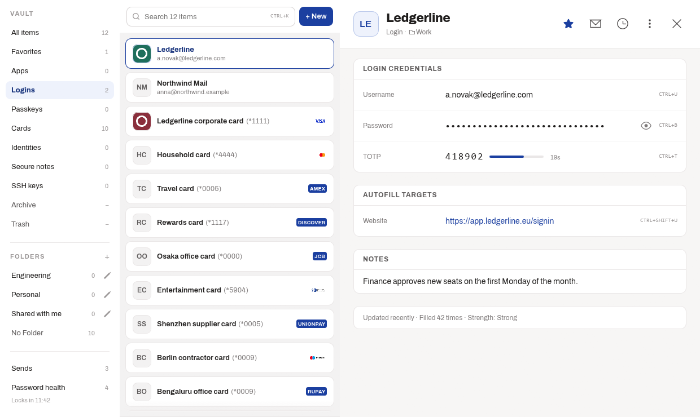

<p align="center">
  
</p>

<h1 align="center">Deskwarden</h1>


[](https://www.rust-lang.org)
[](https://github.com/denis-platonov/Deskwarden/releases/latest)
[](https://github.com/denis-platonov/Deskwarden/releases)
[](https://github.com/denis-platonov/Deskwarden/actions/workflows/ci.yml)
[](https://github.com/denis-platonov/Deskwarden/actions/workflows/ci.yml)
[](https://codecov.io/gh/denis-platonov/Deskwarden)
[](https://buymeacoffee.com/denis.platonov)


> **Unofficial and unaffiliated with Bitwarden.** This is an independent,
> community-built tool. It is not made by, endorsed by, supported by, or
> connected to Bitwarden, Inc. in any way. "Bitwarden" is a trademark of
> Bitwarden, Inc., used here only to describe what this tool interoperates
> with. If you have a problem with this tool, do not contact Bitwarden support
> — open an issue here instead.

**Deskwarden** fills credentials from your Bitwarden vault into **native
Windows applications** — the kind of desktop app or game launcher a browser
extension can't reach — and gives you a vault browser to manage them from,
right in the system tray.

- **[Download the latest release](https://github.com/denis-platonov/Deskwarden/releases/latest)**
  — a per-user Windows installer, no admin rights required.
- **[Full documentation](deskwarden/README.md)** — requirements, trigger modes,
  self-hosted servers, troubleshooting, and security notes.

## Why this exists

Password managers with a browser extension autofill logins on web pages
just fine. None of them reach into a native desktop app or a game launcher's
own login window — that's a browser-extension blind spot every one of them
shares. Some commercial managers (Keeper is one) ship this as a native-app
autofill feature; Bitwarden doesn't, and switching to it from one of those
meant losing that specific capability.

Deskwarden fills that one gap, nothing more: it watches which window has
focus, matches it against your vault by process name, and types the
credentials in — the same idea a QA automation tool like Mabl or a game
launcher's own saved-login flow uses, aimed at a password manager instead.
Everything else (the vault browser, folders, TOTP, sync) exists because a
tray app that can fill into a native window is also the natural place to
*manage* the vault items that do the filling, without a browser extension
open.

## What it does

### Filling

- **Native-app autofill.** Match an app once by process name, pick a trigger
  — fill on focus, an overlay prompt, or a global hotkey (`CTRL+ALT+B`) —
  and the choice is stored on the vault item, so it syncs like any other
  vault data. **This is the thing the official desktop app cannot do**: it is
  Electron, and native windows are not web pages.
- **Typed, not pasted.** Credentials are entered as synthetic keystrokes,
  with per-app key sequences for the forms that need Tab-then-Enter rather
  than a straight username/password pair.
- **A picker when a match is ambiguous**, and a save prompt when you sign in
  to something the vault does not know yet.

### The vault

- **Folders, favourites, archive and trash**, and cuts of the vault by kind:
  logins, cards, identities, secure notes, SSH keys, passkeys.
- **Create, edit and delete items**, including the fields this app does not
  model itself — they are carried back to the server untouched rather than
  dropped.
- **Live TOTP codes** with a countdown, and adding one by **scanning a QR
  code off your own screen** — drag a rectangle over it, no camera, no
  upload.
- **Bitwarden Send**, **per-item master-password re-prompt**, and **export**
  through the CLI.
- **Real favicons** and card-network marks, fetched and cached locally.

### Passwords

- **A password generator** that runs entirely on this machine, including
  passphrases from a bundled word list.
- **Strength indication** on every item.
- **Breach checking** against Have I Been Pwned's k-anonymity range API:
  **your password never leaves this PC** — only the first five characters of
  its SHA-1 hash do, and the range that comes back is searched here.
- **A whole-vault scan** for weak, reused and breached passwords, with a
  history of the last twenty runs (counts and timestamps only, never an item).

### Two backends, and you choose

- **`bw serve` (the default).** Everything goes through the official
  Bitwarden CLI's local bridge: Deskwarden never touches encryption, key
  derivation or sync logic.
- **The built-in client**, on a self-hosted server: Deskwarden talks to your
  server itself and does the decryption, with no background CLI process. It
  is faster and much lighter. The trade is that the key unlocking your vault
  is kept on this PC under DPAPI and does not expire — the setting says so
  before you turn it on.
- **Signing in no longer uses the CLI either way.** A direct-REST account
  authenticates against the server itself. The CLI is required only where
  `bw serve` is the vault -- every account on bitwarden.com and
  bitwarden.eu -- and Deskwarden acquires it for you at that point rather
  than the installer fetching it for everybody in advance.

### Where your vault lives

Deskwarden works with any Bitwarden-compatible server. Three options, and
the trade-offs are real ones:

- **[Bitwarden's own service](https://bitwarden.com/)** — recommended if you
  want the least to think about. It is the reference implementation, run by
  the people who make Bitwarden, with a free tier. Deskwarden needs
  Bitwarden's command-line program for this option and will offer to install
  it when you choose one of their servers.

- **[Vaultwarden](https://github.com/dani-garcia/vaultwarden)** — an
  independent server that speaks the same API, written in Rust and small
  enough to run on a cheap VPS or a home machine. You host and back it up
  yourself. **Not tested with Deskwarden**, but nothing here is specific to
  one server and it should work; if you try it, please open an issue either
  way.

- **[NodeWarden](https://github.com/shuaiplus/nodewarden)** — another
  independent server, running on Cloudflare Workers, which can be free at
  personal scale and needs no machine of your own to maintain. This is what
  Deskwarden's author uses day to day, so it gets exercised, though it is a
  third-party project neither written nor maintained here.

Vaultwarden and NodeWarden are unofficial and unaffiliated with Bitwarden,
Inc., as is Deskwarden. Self-hosting means the backups and the uptime are
yours; that is the price of the control.

On a self-hosted server Deskwarden can talk to it directly and skip the
command-line program entirely — faster to start, and about 118 MB of RAM it
does not use.

### Everywhere else you use your vault

Deskwarden is a Windows desktop app and nothing else. It is deliberately one
piece of a set, not a replacement for one — the same vault, reached from
whatever you happen to be using:

| Where | Use |
| --- | --- |
| **Windows desktop and native apps** | Deskwarden — this is the gap it fills |
| **Your browser** | [Bitwarden's extensions](https://bitwarden.com/download/) — Chrome, Firefox, Edge, Safari and the rest |
| **Android / iOS** | [Bitwarden's mobile apps](https://bitwarden.com/download/), on Google Play and the App Store |

**These all work with a self-hosted server too.** Every official Bitwarden
client lets you point it at your own server URL before you log in, so
choosing Vaultwarden or NodeWarden does not cost you the browser extension or
the phone app.

Deskwarden exists because that set has a hole in it on Windows: browser
extensions fill web forms, and nothing official fills a **native** Windows
application. That is what commercial password managers do well and what this
app is built to match — the vault you already have, reaching the windows a
browser extension cannot see.

### Keeping secrets where they belong

- **Windows Hello** to unlock, and to hold the key for the encrypted local
  copy in this PC's TPM.
- **An optional encrypted copy of your vault on this PC** (off by default),
  sealed so that a copied disk cannot be read on another machine. It survives
  a restart, and is deleted on logout, on a master-password re-prompt, or
  after seven days.
- **Clipboard that clears itself**, and marks copied secrets so clipboard
  managers and cloud history do not retain them.
- **Locks when you walk away** — Win+L, a session switch, or suspend.
- **No secret on a command line**, anywhere, ever: a Windows command line is
  readable by any process on the machine.
- **Updates are verified** — the installer's Authenticode signature is checked
  against a pinned signer before anything runs.

### Also

- **Multiple accounts**, switchable from the tray.
- **A local HTTP API** for your own scripts — see below.
- **~36 MB resident** in the tray, and a window that runs as its own process
  so closing it actually returns the memory.
## The local vault service

An optional loopback HTTP service that answers **the same API `bw serve`
does** — `/status`, `/list/object/items`, `/list/object/folders`,
`/object/item/{id}`, in the same `{"success":true,"data":{...}}` envelope — so
a script already written against `bw serve` keeps working. Behind it is not the
CLI, though: it is Deskwarden's own direct-REST backend, which is why the
service is **self-hosted only** and refuses to start for an account with no
server URL.

**The one deliberate incompatibility:** `bw serve` requires no credential at
all, and this requires `Authorization: Bearer <key>` on every request. That is
the reason it exists. Everything else about the wire format is the same.

**It is off by default, and when it is on it serves decrypted vault items** —
usernames, passwords, TOTP seeds — to anything on this machine that presents a
key. Read the limits below before turning it on.

### What the key protects, and what it does not

- **It stops** another user on the machine, and anything that reaches loopback
  without being able to read your files, from getting the vault by connecting
  to the port. That is exactly what `bw serve` does not stop.
- **It does not stop a program already running as you.** The key store is
  DPAPI-wrapped, so it unwraps under your Windows credentials — and so does
  anything else you run. A key is for containing a script and being able to
  revoke it, not for defending a machine that is already compromised.

That is the same limit the cached session token and the stored vault key
already have, and scoping does not remove it.

### Turning it on

1. Preferences → **Vault service** → turn the service on. Until you do, the
   process refuses to start and says so in the log.
2. On the same screen, mint a key: give it a name, an expiry (or none), and its
   scopes. **The key is shown once** — the store keeps only `SHA-256(key)`, so
   there is nothing to read it back out of.
3. Start it: `deskwarden.exe --service` runs it for as long as an app needs it,
   and `deskwarden.exe --service installed` runs it as a service that outlives
   every app.

It binds `127.0.0.1` on a **free port chosen at start** — the bind address is
not configurable, deliberately — and writes the port it got to the log:
`the vault service is listening on 127.0.0.1:<port>`. Exit code `3` means the
command line was fine and the service will not run (switched off, no active
account, no stored vault key, no server URL, or the port could not be bound);
`2` means the command line itself was wrong.

### Calling it

```bash
PORT=54321          # from the log line above
KEY=<the key you minted>

curl -H "Authorization: Bearer $KEY" http://127.0.0.1:$PORT/status
curl -H "Authorization: Bearer $KEY" http://127.0.0.1:$PORT/list/object/items
curl -H "Authorization: Bearer $KEY" http://127.0.0.1:$PORT/list/object/folders
curl -H "Authorization: Bearer $KEY" http://127.0.0.1:$PORT/object/item/<item-id>
```

Those four are the whole API. `/status` reports lock state and nothing else —
not the account's email, not the server URL — because a live key is enough to
reach it.

### Status codes

| Code | What it means |
| --- | --- |
| `200` | Served. |
| `401` | **The credential is wrong**: missing, not a `Bearer` header, unknown, or expired. Also what an unknown path returns to an unauthenticated caller — the credential is checked *before* the path is read, so a stranger cannot map the API by watching which paths 404. |
| `403` | **The credential is right and does not cover this.** Distinct from `401` on purpose: a script has to be able to tell "your key is bad" from "your key needs a wider scope". |
| `404` | Authenticated, and there is no such route — or no such item id. |
| `405` | Authenticated, the route exists, and the method is not one this service understands. |
| `501` | `POST /auth`. See below. |

### Scopes

A key holds a set of `(subject, access)` pairs:

- **Subject**: *All* (the whole vault), a *category* (Login, Card, Identity,
  Secure Note, SSH Key), or a *single item* by id.
- **Access**: *read* or *write*. Neither implies the other.

**An empty scope set grants nothing**, and so does a subject a build does not
recognise — an older Deskwarden reading a newer key file denies rather than
widens. Expiry is judged per request against the clock at that moment, so a
service that has been up for a week does not honour a key that died on Tuesday.

A **list** request is filtered rather than refused: a key scoped to Logins may
call `/list/object/items` and gets back only the Logins. A **single-item** fetch
is judged against that id, so a category-scoped key is refused there (`403`) and
reaches the same items through the filtered list instead. Folders carry no
secret and are not filtered.

### What is not built yet

- **`POST /auth` answers `501`.** The master-password exchange that would issue
  a short-lived session token is designed but not implemented; the service has
  no way to take a master password at all. Named API keys are the only way in.
- **No route changes anything.** Write access exists in the scope model and is
  checked, but every route this service serves today is a read; a write-scoped
  request to `/object/item/{id}` is permitted and still modifies nothing.
- **Nothing in Deskwarden uses it yet.** The tray daemon and the vault window
  still talk to `bw serve` (or to the direct backend in-process). Pointing them
  here is a change of base URL, and it has not been made.
- **Every request re-reads the vault** from the server rather than serving a
  snapshot, so the service is correct against edits made in the app and is not
  fast. It does not read the encrypted disk cache.

## Screenshots



**[More screenshots](docs/SCREENSHOTS.md)** -- one item, password health,
two-factor codes, preferences, signing in.

Rendered from fixtures by `cargo run --example ui_preview -- --all`: no vault
is read, no network touched, no `bw` spawned. The real UI, nobody's real
logins.

## Stack, and why

| Choice | Reasoning |
| --- | --- |
| **Rust** | Native Win32/COM interop (UI Automation, DPAPI, WinTrust, Job Objects) without an FFI layer on top of a managed runtime, and a single static binary with no runtime to install. |
| **[`windows`](https://crates.io/crates/windows) crate (raw Win32/WinRT bindings)**, not a higher-level GUI-automation library | The two things that actually need OS-level access — reading whatever window is in the foreground, and typing into an arbitrary native control — don't have a portable abstraction worth building on. Direct bindings also make the Authenticode signature check on the `bw.exe` the app downloads (real `WinVerifyTrust`, not a shelled-out PowerShell call -- and since the installer stopped bootstrapping the CLI, this is the crate's only Authenticode mechanism rather than one of two) and the DPAPI-encrypted session cache possible without another dependency. |
| **[`eframe`/`egui`](https://github.com/emilk/egui) (immediate-mode GUI)** | A tray app with a handful of small windows (login, an autofill overlay, a picker, the vault browser) doesn't need a retained-mode widget tree or a bundled browser engine — egui compiles into the same static binary and adds single-digit megabytes, not a WebView2 dependency. |
| **The Bitwarden CLI (`bw`) as the vault backend for official Bitwarden servers**, via its local `bw serve` REST bridge — with a direct one for self-hosted servers | Reimplementing Bitwarden's cryptography is a security liability a community tool should not take on lightly, so for a long time it was not taken on at all. It has been now, for self-hosted servers only, and since 0.15.0 it is what a new self-hosted account gets without opting in — bitwarden.com and bitwarden.eu still go through the CLI, as does every account created before that release: `bw serve` is a bundled Node runtime costing ~118 MB of RAM, which is more than the rest of the app put together. The direct path is checked against Bitwarden's own published test vectors, and every write is laid over the JSON the server sent so a field this app cannot decrypt survives an edit untouched. On the default path Deskwarden still only ever talks to `localhost`. |
| **DPAPI** for the cached session token, **Windows Hello** (`KeyCredentialManager`) for optional quick-unlock | Both are already the OS's own answer to "encrypt this for the current Windows user" — no key management of Deskwarden's own to get wrong. |

## Size

Numbers from an actual release build (`cargo build --release`, with LTO +
single codegen unit + stripped symbols), measured live and side-by-side
against the official Bitwarden desktop app on the same machine — not vendor
figures, not estimates.

Deskwarden has two backends and two processes, so a single number would be
wrong four ways. What follows is private working set -- the figure Windows
Task Manager's "Memory" column shows -- measured on one machine, re-measured
on 0.15.6.

**Which counter, and why it matters here.** The same idle process reads
~19 MB of private working set, ~44 MB of working set, and ~21 MB of private
bytes: three numbers, a factor of two apart, all correct. PowerShell's
`Get-Process` reports the latter two and not the first, so a figure checked
that way will not match this table and nothing is wrong. Every number below
is private working set, which is what Task Manager shows you by default.

**The tray, which is the state that lasts hours:**

| | Deskwarden's own process | `bw serve` beside it |
| --- | --- | --- |
| Default backend (official CLI) | ~10 MB | ~118 MB |
| Direct backend (self-hosted only) | ~19 MB | **none** |

The direct backend's own process is larger because it holds the vault and the
cryptography itself. It is still about a seventh of the pair it replaces.

**The vault window** costs ~76 MB while open, usually in a process of its
own. Usually, not always: on the direct backend, before a master password has
been entered once, only the tray process can ask for one -- so it hosts the
window itself and you see a single process carrying both figures. It exits
when you close it, and that is the point: it is an accelerated-graphics window,
and the GPU driver never returns what it takes, so the only way to get that
memory back is for the process holding it to end. Everything that appears
during an autofill -- the fill prompt, the locked-vault card, the save-login
card, the generator, the unlock prompt -- is drawn directly by Windows instead,
costing under 2 MB each and loading no driver at all.

**Against Bitwarden Desktop**, measured side by side on the same machine: it
sits at 132-135 MB across its four processes. Deskwarden on the default backend
is close to parity once the CLI is counted -- which it has to be, because it is
what does the vault work. On the direct backend, idling in the tray, it is
~19 MB against ~132 MB.

If idle RAM matters and you are on the default backend, `bw serve` can be shut
down when nothing needs it: Preferences -> Sync & account -> "Keep the
Bitwarden backend running". Autofill stays instant because vault data is served
from an in-memory cache. Turning it off used to mean the first operation after
a restart paid the backend's ~8 s cold start; with the encrypted disk copy on as
well it does not, because the snapshot is already there. The two settings were
built for each other.
**Disk**:

| | Deskwarden | Bitwarden Desktop |
| --- | --- | --- |
| App itself | ~16 MB | 456 MB |
| Fresh install (app alone) | ~51 MB | 456 MB |
| After signing in to an official server (app + `bw` CLI) | ~169 MB | 456 MB |

Two rows rather than one, because a fresh install is now the app alone.
The installer no longer fetches the Bitwarden CLI; Deskwarden asks, and then
downloads and verifies it, at the moment you choose a server that requires
it. A new self-hosted account uses the built-in client, so the second row
never happens.

Source: ~188,000 lines of Rust across 103 modules, roughly a third of it
production code and the rest tests.

## Dependencies

Everything Deskwarden links against, and what it's for:

| Crate | What it's for |
| --- | --- |
| `windows` | Win32/WinRT bindings: UI Automation, `SendInput`, DPAPI, WinVerifyTrust (Authenticode), Job Objects, DWM, GDI, Shell, Windows Hello. |
| `eframe` / `egui` (glow backend) | The GUI: login, overlay, pickers, vault window. |
| `tray-icon`, `global-hotkey` | The system tray icon/menu and the global fill hotkey. |
| `ureq` | HTTP client — talks to the local `bw serve` bridge and, for real website favicons, the Bitwarden icon service (or a self-hosted server's own icon proxy). |
| `serde`, `serde_json` | (De)serializing everything that crosses the `bw serve` HTTP boundary. |
| `aes-gcm`, `sha2` | Sealing the master password under a Windows Hello signature-derived key for quick unlock. |
| `zeroize` | Wiping decrypted secrets (session tokens, the master password buffer) from memory after use. |
| `png` | Decoding fetched favicons to RGBA. |
| `directories` | Locating the standard Windows config/cache directories. |
| `semver` | Comparing versions for the update checker. |
| `log`, `env_logger` | The log file — this is a console-less GUI-subsystem binary, so the log file is the only diagnostic channel. |
| `mockito` (dev-only) | Mocking `bw serve`'s HTTP API in tests. |

Full versions and feature flags: [`deskwarden/Cargo.toml`](deskwarden/Cargo.toml).

## Repository layout

| Path | What's in it |
| --- | --- |
| [`deskwarden/`](deskwarden/) | The Rust crate: the app itself, plus its Inno Setup installer under `deskwarden/installer/`. |
| [`docs/`](docs/) | Design specs and implementation plans. |
| [`.github/workflows/`](.github/workflows/) | The release pipeline (build, package, publish on a `vX.Y.Z` tag). |

## Building from source

Requires a Rust toolchain and Windows 10 or 11:

```
cd Deskwarden
cargo build --release
```

See [`deskwarden/installer/README.md`](deskwarden/installer/README.md) for how
the installer is built.

### Two things that will surprise you

**Do not run `cargo fmt`.** Many tests in this crate are *source pins*: they
read the source text and assert on it, to hold properties a type system
cannot — that a particular function has exactly one call site, that a
module starts no processes, that a piece of user-facing copy does not promise
something the code stopped doing. `rustfmt` would rewrite about 5,200 spans
across `src/`, breaking dozens of those pins at once and burying any real
change in the churn. Formatting is deliberately not a gate here; match the
style of the code around you instead.

**Source files are CRLF, and the pins compare raw bytes.** An editor or
script that writes LF will redden pins with failures that look like logic
errors — this has cost real debugging time more than once. If a batch of
unrelated pins goes red after a scripted edit, check the line endings before
you check the logic.

## Privacy

Deskwarden has no servers, no accounts, no analytics and no telemetry.
Nothing is sent to the developer — not usage data, not crash reports,
nothing — and there is no mechanism in the software to do so, nor any plan
to add one. What it reads, what it stores, the five network requests it
makes and which of them you can turn off are set out in
[PRIVACY.md](PRIVACY.md).

Changes between releases are in [CHANGELOG.md](CHANGELOG.md).

## No warranty, and use at your own risk

**This software is provided as is, with no warranty of any kind, and you use
it at your own risk.** That is not throat-clearing: it is sections 15 and 16
of the [AGPL-3.0](LICENSE) this is released under, stated here in plain words
because a licence file is not where anyone looks.

Specifically, and worth reading before you trust it with a vault:

- **The author is not liable** for any loss, disclosure or corruption of your
  passwords or other data, however caused, to the fullest extent the law
  allows.
- **This is a community project**, built by one person, not audited by a
  security firm. It handles secrets, and it will have bugs. Some of them will
  be mine and some will be in the dependencies underneath it.
- **Keep your vault backed up independently.** Your Bitwarden-compatible
  server is the source of truth; this is a client, and no client should be the
  only place your data exists.
- **Some features widen your exposure and say so where you turn them on** --
  the encrypted local copy, and the local HTTP API most of all. Read what each
  one tells you rather than only this page.

Deciding whether it is fit for what you need is yours to make. The source is
here to be read, and [PRIVACY.md](PRIVACY.md) sets out exactly what leaves
this machine and when.

## License

AGPL-3.0-or-later — see [LICENSE](LICENSE). (The same license also ships with the crate at
[`deskwarden/LICENSE`](deskwarden/LICENSE).)

---

<!-- The star-history chart that used to be here stopped working on
     2026-06-30, when GitHub restricted the stargazers API to a
     repository's own admins and collaborators. Every third-party chart
     service reads that endpoint, so none of them can draw this any more --
     the image was rendering as a broken link rather than a chart. Replaced
     with the count itself, which comes from an endpoint that still works. -->
<p align="center">
  <a href="https://github.com/denis-platonov/Deskwarden/stargazers">
    
  </a>
</p>
