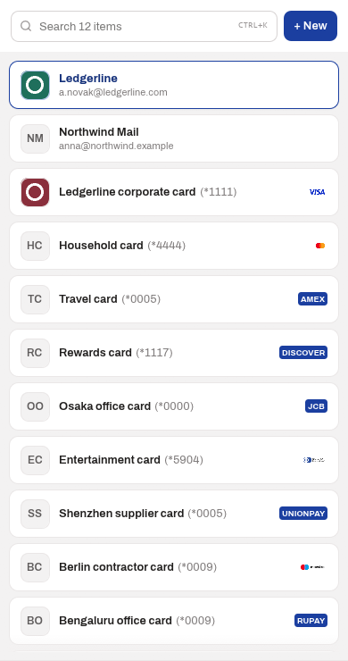
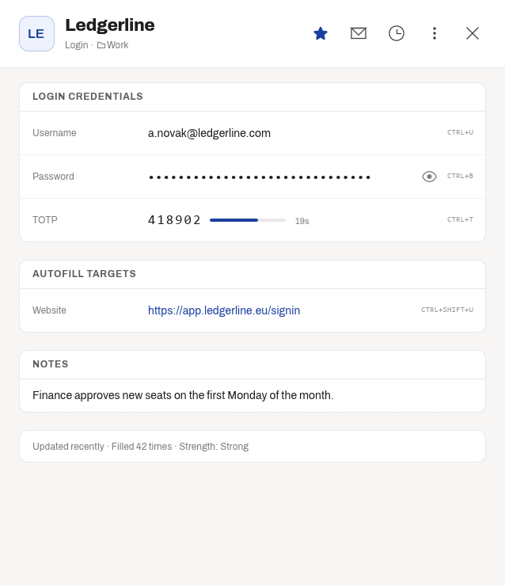
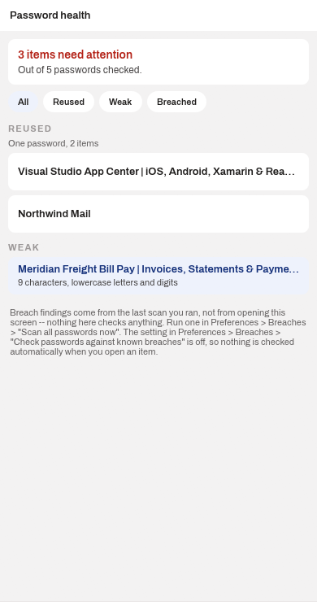
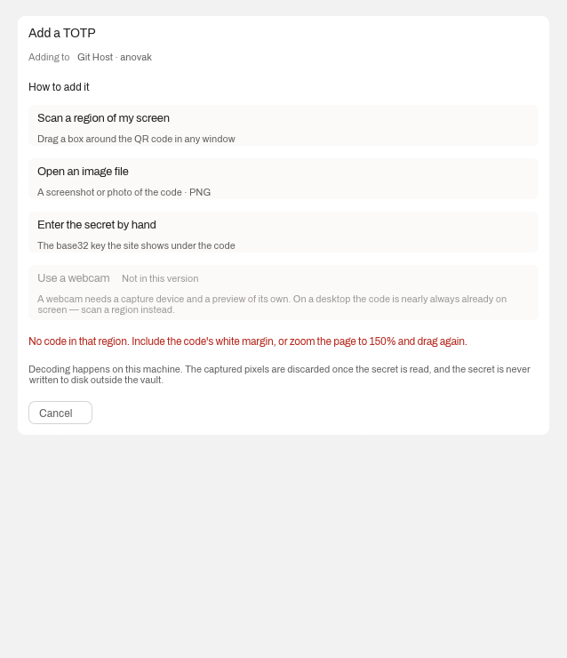
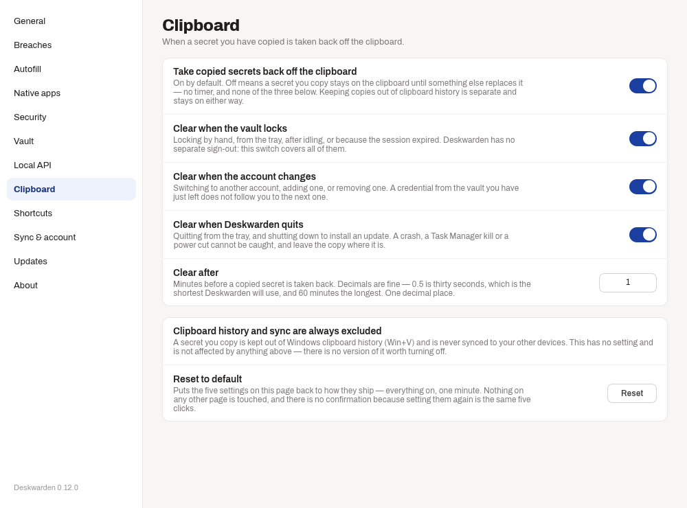
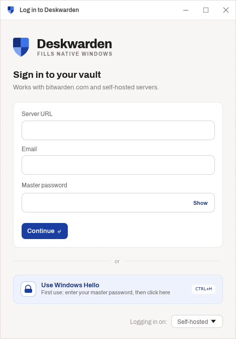

# Screenshots

Every image here is rendered by `cargo run --example ui_preview -- --all`, the
same example CI runs on every push.

**They are fixtures.** The example's own documentation is explicit: no surface
it draws reads a real vault, touches the network, or spawns `bw`. That is what
makes it safe to publish pictures of a password manager's UI at all — these
show the real interface and nobody's real logins.

The full set is forty-six surfaces, including every error state, empty state
and spinner. It is uploaded as the `ui-screenshots` artifact on
[any CI run](https://github.com/denis-platonov/Deskwarden/actions/workflows/ci.yml).
The six below are the ones worth looking at first.

## The vault

## One item

## Password health

Every distinct password checked against Have I Been Pwned's k-anonymity range
API — the password never leaves the machine, only a five-character hash prefix
does.

## Adding a two-factor code

## Preferences

## Signing in

